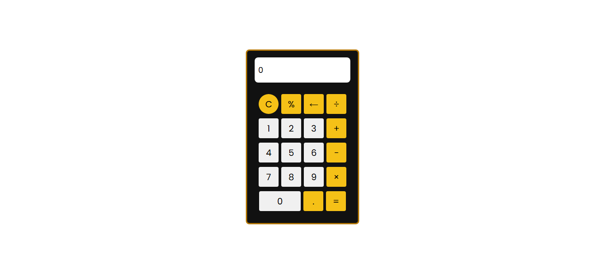

# 🧮 Simple Calculator

> A clean, responsive calculator built with HTML, CSS, and JavaScript

## ✨ Features

- Basic operations (+, -, ×, ÷)
- Error handling
- Clean UI


## 📸 Screenshots



## 🛠️ Technologies


## 📦 Installation

```bash
git clone https://github.com/itz-vold/simple-calculator.git
cd simple-calculator
```

Open `index.html` in your browser.

## 🎯 Usage

**Mouse:** Click buttons for numbers and operations.  

## 📱 Responsive

Works on desktop, tablet, and mobile.

## 🤝 Contributing

Pull requests welcome.

## 📝 License

MIT

---

Made with ❤️